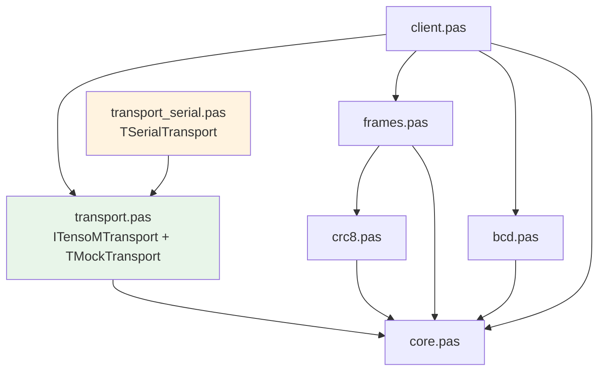

# TensoMLib

Библиотека на Free Pascal / Lazarus для работы с весовыми приборами Тензо-М по протоколу Тензо-М (RS-232 / RS-485).
## Возможности

    Низкоуровневый кодек кадров протокола Тензо-М (кодирование скорости, длины, CRC)
    Модульный транспортный слой: интерфейс ITensoMTransport, реализация для COM-порта
    Высокоуровневый клиент TTensoMDevice с автоматическими ретраями и логированием кадров
    Юнит-тесты через FPCUnit (транспорт, клиент, ретраи, логирование)
    Расширяемая архитектура

## Структура

```
src/core.pas — типы, константы COP, записи (TWeightData, TParsedFrame, TErrorInfo)
src/crc8.pas — CRC-8, полином $69 (MakeCRC / VerifyCRC / CRCUpdate)
src/bcd.pas — упакованный BCD little-endian, DecodeWeight
src/frames.pas — BuildFrame, TFrameCollector (state machine), ParseFrame
src/transport.pas — ITensoMTransport, TMockTransport, BaudRateToValue/ToCode
src/transport_serial.pas — TSerialTransport (LazSynaSer), ScanSerialPorts
src/client.pas — TTensoMDevice (фасад)
tests/ — юнит-тесты (test_crc, test_bcd, test_frames, test_transport, test_client)
tests/integration/ — интеграционные тесты
demo/console/demo.lpr — простой пример использования
demo/monitor/checktensom.lpr — GUI программа для тестирования по протоколу Тензо-М
tests/integration/tensotest.lpr — утилита тестирования реального прибора (XML-отчёт)
```
 

### Иерархия зависимостей



 

## Быстрый старт

```pascal
uses
  transport_serial, client;

var
  Tr: TSerialTransport;
  Dev: TTensoMDevice;
  W: Double;
begin
  Tr := TSerialTransport.Create;
  try
    Tr.Connect('COM3', 9600, 8, 'N', 1, 500);
    Dev := TTensoMDevice.Create(Tr, 1);
    try
      if Dev.GetBruttoWeight(W) then
        WriteLn(Format('Brutto: %.3f кг', [W]))
      else
        WriteLn('Ошибка: ', Dev.LastErrorMessage);
    finally
      Dev.Free;
    end;
  finally
    Tr.Disconnect;
    Tr.Free;
  end;
end;
```
 
# Зависимости

     Free Pascal Compiler ≥ 3.2
     Lazarus ≥ 3.0
     Пакет LazSerial (только для COM-порта)

# Лицензия

MIT © 2026, Renat Suleymanov, https://github.com/Al-Muhandis