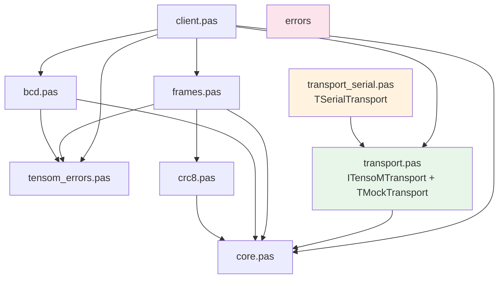

# TensoMLib

Библиотека на Free Pascal / Lazarus для работы с весовыми приборами Тензо-М по протоколу Тензо-М (RS-232 / RS-485).

## Возможности

- Низкоуровневый кодек кадров протокола Тензо-М (кодирование скорости, длины, CRC-8, байт-стаффинг FF→FF FE)
- Иерархия исключений по семантике ошибок (транспорт, таймаут, CRC, кадр, устройство, протокол)
- Модульный транспортный слой: интерфейс `ITensoMTransport`, мок `TMockTransport` для тестирования, реализация `TSerialTransport` для COM-порта (LazSynaSer + WinAPI DCB fallback для нестандартных USB-COM драйверов)
- Высокоуровневый клиент `TTensoMDevice` с автоматическими ретраями, настраиваемой политикой повторов, логированием кадров и автоопределением режима CRC
- Полный набор команд протокола: вес, тарирование, конфигурация, серийный номер, дискретные входы/выходы, индикаторы, счётчики, калибровка, дозирование, инициативная передача
- Функции сканирования доступных COM-портов (Windows: QueryDosDeviceA, Linux: /dev/ttyS*, /dev/ttyUSB*, /dev/ttyACM*)
- Юнит-тесты через FPCUnit (CRC, BCD, кадры, транспорт, клиент — включая ретраи, логирование, иерархию исключений)
- Интеграционная тестовая утилита с XML-отчётом
- Пакет времени выполнения для Lazarus (`tensom_rt.lpk`)
- Расширяемая архитектура

## Структура

```
src/
  core.pas              — типы, константы COP, записи (TWeightData, TParsedFrame, TErrorInfo),
                           вспомогательные функции (HexBytes, ErrorDescription)
  errors.pas            — иерархия исключений:
                           ETensoMError
                             ├── ETensoMTransportError
                             │     └── ETensoMTimeoutError
                             ├── ETensoMFrameError
                             │     └── ETensoMCRCError
                             ├── ETensoMDeviceError
                             └── ETensoMProtocolError
  crc8.pas              — CRC-8, полином $69 (CRCUpdate / MakeCRC / VerifyCRC)
  bcd.pas               — упакованный BCD little-endian: DecodePackedBCD, EncodePackedBCD, DecodeWeight
  frames.pas            — BuildFrame, TFrameCollector (конечный автомат), ParseFrame
  transport.pas         — ITensoMTransport, TMockTransport, BaudRateToValue / BaudRateToCode
  transport_serial.pas  — TSerialTransport (LazSynaSer + WinAPI DCB fallback), ScanSerialPorts
  client.pas            — TTensoMDevice (фасад): вес, тарирование, конфигурация,
                           серийный номер, статус, дискретные В/В, индикаторы,
                           счётчики, калибровка, АЦП, дозирование,
                           инициативная передача, отображение сообщений,
                           автоопределение CRC, ретраи, протоколирование кадров
  tensom_rt.lpk         — пакет времени выполнения Lazarus

tests/
  test_crc.pas          — тесты CRC-8 (векторные, MakeCRC, VerifyCRC, краевые)
  test_bcd.pas          — тесты BCD-кодирования/декодирования и декодирования веса
  test_frames.pas       — тесты построения, сбора и разбора кадров
  test_transport.pas    — тесты интерфейса транспорта и мока
  test_client.pas       — тесты клиента: вес, тарирование, конфигурация, ошибки,
                           ретраи, логирование, иерархия исключений
  run_tests.lpr         — консольный запускатор юнит-тестов (FPCUnit)
  run_tests_gui.lpr     — GUI-запускатор юнит-тестов (FPCUnit)
  integration/
    tensotest.lpr       — утилита тестирования реального прибора (XML-отчёт + лог кадров)

demo/
  console/
    demo.lpr            — консольный пример: сканирование портов, подключение,
                           автоопределение CRC, серийный номер, конфигурация, 5 чтений веса
  monitor/
    checktensom.lpr     — GUI-программа (Lazarus) для тестирования по протоколу Тензо-М:
                           подключение, сканирование портов, вес (брутто/нетто),
                           серийный номер, статус, адрес, индикаторы, АЦП,
                           дискретные В/В, калибровка, весовые точки,
                           спец. параметры, инициативная передача, лог-файл
    mainform.pas        — основная форма монитора
    mainform.lfm        — ресурсы формы
```

### Иерархия зависимостей



## Быстрый старт

```pascal
uses
  transport_serial, client;

var
  Tr: TSerialTransport;
  Dev: TTensoMDevice;
  W: TWeightData;
begin
  Tr := TSerialTransport.Create;
  try
    Tr.Connect('/dev/ttyUSB0', 9600);
    Dev := TTensoMDevice.Create(Tr, 1);
    try
      Dev.ResponseTimeout := 1000;

      { Автоопределение режима CRC (без/с CRC) }
      Dev.AutoDetectCRC;

      W := Dev.GetBruttoWeight;
      WriteLn(Format('БРУТТО: %.3f кг, стабилен: %s',
        [W.Weight, BoolToStr(W.Stable, 'да', 'нет')]));

      W := Dev.GetNettoWeight;
      WriteLn(Format('НЕТТО: %.3f кг', [W.Weight]));

      { Тарирование }
      Dev.Tare;
    finally
      Dev.Free;
    end;
  finally
    Tr.Disconnect;
    Tr.Free;
  end;
end;
```

## Сборка

### Юнит-тесты (консольные)

```bash
# Из корня репозитория
fpc -MObjFPC -Sh -FUsrc -Futests tests/run_tests.lpr
./run_tests --format=plain
```

### Консольное демо

```bash
# Linux / macOS
fpc -MObjFPC -Sh -FUsrc demo/console/demo.lpr
./demo

# Windows
fpc -MObjFPC -Sh -FUsrc demo/console/demo.lpr
demo.exe
```

### GUI-монитор

Открыть `demo/monitor/checktensom.lpi` в Lazarus и собрать (требуется пакет LazSerial).

### Пакет Lazarus

Открыть `src/tensom_rt.lpk` в Lazarus → «Установить». Библиотека будет доступна в проектах через менеджер пакетов.

### Интеграционные тесты (с реальным прибором)

```bash
fpc -MObjFPC -Sh -FUsrc -Futests tests/integration/tensotest.lpr
./tensotest /dev/ttyUSB0 1 3000
# или на Windows:
# tensotest COM3 1 3000
```

Результат: XML-отчёт и лог кадров в текущем каталоге.

## API клиента (TTensoMDevice)

### Весовые измерения

| Метод | COP | Описание |
|-------|-----|----------|
| `GetBruttoWeight: TWeightData` | C3h | Вес брутто (значение, стабильность, перегруз, знак, запятая) |
| `GetNettoWeight: TWeightData` | C2h | Вес нетто |
| `Tare` | C0h | Обнуление / тарирование |

### Конфигурация прибора

| Метод | COP | Описание |
|-------|-----|----------|
| `GetDeviceConfig(out MaxWeight, Division, DecimalPlaces, Mode, ADCFreqCode, FilterCode)` | C1h | Параметры прибора: макс. вес, дискретность, режим (БРУТТО/НЕТТО), частота АЦП, фильтр |
| `SetBaudRate(RateCode)` | DBh | Установка скорости обмена (переводит и прибор, и COM-порт) |
| `SetFilter(FilterCode)` | DAh | Полоса пропускания фильтра |
| `SetADCFrequency(FreqCode)` | D9h | Частота обновления АЦП |

### Системная информация

| Метод | COP | Описание |
|-------|-----|----------|
| `GetSerialNumber: Cardinal` | A1h | Серийный номер (3 байта) |
| `GetSystemStatus: Byte` | BFh | Байт состояния весоизмерительной системы |
| `SetNetworkAddress(NewAddr)` | A0h | Присвоение нового сетевого адреса ($01..$9F) |

### Дискретные входы/выходы

| Метод | COP | Описание |
|-------|-----|----------|
| `GetDiscreteInputs: TBytes` | C4h | Состояние дискретных входов |
| `GetDiscreteOutputs: TBytes` | C5h | Состояние дискретных выходов |
| `SetDiscreteOutputs(Value)` | D0h | Установка сигналов на выходах |

### Индикаторы и клавиатура

| Метод | COP | Описание |
|-------|-----|----------|
| `GetIndicators(out Text, out Flags)` | C6h | Текст и флаги индикатора |
| `GetProductCode: string` | C7h | Введённый код продукта |

### Счётчики

| Метод | COP | Описание |
|-------|-----|----------|
| `GetCounter(CounterNum): TBytes` | C8h | Счётчик №0..9 |

### Калибровка и диагностика

| Метод | COP | Описание |
|-------|-----|----------|
| `GetCalibrationParams: TBytes` | CBh | Параметры калибровки |
| `GetADCCode: TBytes` | CCh | Код АЦП |

### Дозирование

| Метод | COP | Описание |
|-------|-----|----------|
| `DosingControl(Cmd)` | DFh | Управление дозированием (стоп/старт/пауза/продолжение) |

### Инициативная передача

| Метод | COP | Описание |
|-------|-----|----------|
| `StartInitTransmit(COP)` | CEh | Запуск инициативной передачи |
| `StopInitTransmit` | CFh | Остановка инициативной передачи |

### Отображение

| Метод | COP | Описание |
|-------|-----|----------|
| `DisplayMessage(DeviceNum, Msg)` | D2h | Вывод символьного сообщения на индикатор |
| `SetDisplayWeightMode` | CDh | Перевод прибора в режим индикации веса |

### Диагностика

| Метод | Описание |
|-------|----------|
| `AutoDetectCRC: Boolean` | Автоопределение режима CRC: пробует без CRC, затем с CRC. Меняет свойство `UseCRC` |

### Свойства

| Свойство | Тип | Описание |
|----------|-----|----------|
| `Address` | Byte | Сетевой адрес прибора (только чтение) |
| `UseCRC` | Boolean | Включение/выключение CRC в кадрах |
| `ResponseTimeout` | Cardinal | Таймаут ожидания ответа, мс (по умолчанию 700) |
| `RetryCount` | Integer | Количество повторов при транспортных ошибках и ошибках кадров (0 = без повторов). Ошибки прибора (EEh), неподдерживаемые команды (FDh) и semantic-ошибки **не** повторяются |
| `RetryDelayMS` | Cardinal | Пауза между повторами, мс (по умолчанию 0) |
| `OnFrameLog` | TFrameLogEvent | Callback для логирования каждого отправленного и полученного кадра (hex-строка) |
| `LastRequestHex` | string | Hex-дамп последнего отправленного кадра |
| `LastResponseHex` | string | Hex-дамп последнего полученного кадра |
| `LastError` | string | Текст последней ошибки |

## Зависимости

- Free Pascal Compiler >= 3.2
- Lazarus >= 3.0
- Пакет LazSerial (LazSerialPort) — только для работы с реальным COM-портом.
  Без него доступны все модули кроме `transport_serial`, а тесты работают через `TMockTransport`

## Лицензия

MIT (c) 2026, Renat Suleymanov, https://github.com/Al-Muhandis